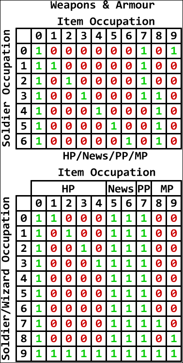

# Barcode Battler II Card System (European Version)

## Introduction
This document describes the card system used in the European version of Barcode Battler II, including the barcode structure and how they translate into game cards.

## Document Structure
1. [Card Types](#card-types)
2. [Barcode Structure](#barcode-structure)
3. [Conversion Algorithm](#conversion-algorithm)
   - [Method 1 (UPC-A / EAN-13)](#method-1-upc-a--ean-13)
   - [Method 2 (EAN-13 / EAN-8)](#method-2-ean-13--ean-8)
4. [Flags (Abilities)](#flags-abilities)
5. [Exceptions](#exceptions)
6. [Power-Up Compatibility](#power-up-compatibility)
7. [Technical Specifications](#technical-specifications)

## Card Types

### Main Categories

1.  **Warriors**
    *   Main battle cards in the game
    *   Two distinct warrior classes:
        *   **Soldiers**: Physical combat focused warriors
        *   **Wizards**: Magic-based warriors
    *   Each warrior has the following stats:
        *   Life Points (HP - Hit Points)
        *   Strength (ST - Attack Power)
        *   Defense (DF - Defense Power)
        *   Dexterity (DX - Sometimes referred to as Speed, affects battle in undetermined ways)
        *   Power Points (PP - Used by Soldiers for special actions, TBD)
        *   Magic Points (MP - Used by Wizards for spells, TBD)
        *   Race/Tribe (Determines type, e.g., Mechanical, Animal)
        *   Occupation (Determines compatibility and effectiveness)
        *   Flag (Special ability)
    *   Can be equipped with items to enhance their stats

2.  **Items (Power-Ups)**
    *   Used to equip and power up warriors
    *   Can modify:
        *   Life Points (HP)
        *   Strength (ST)
        *   Defense (DF)
    *   Categories:
        *   **Weapons (Single Use / Durable):** Increase ST.
        *   **Armour (Single Use / Durable):** Increase DF.
        *   **Health:** Increase HP.
        *   **Herb:** Increase Herb Points (Function TBD).
        *   **Magic:** Increase Magic Points (Function TBD).
        *   **News (Vague / Accurate):** Function in C1 mode only.
    *   Items also have Race, Occupation, DX, and Flag values.

### System Notes

*   A card can only belong to one main category (Warrior or Item).
*   Warriors can equip items based on compatibility rules.
*   The transformation system allows combining warriors with items for enhanced stats.
*   Wizards primarily use Magic Points (MP) for their abilities (details TBD).
*   Herb Points (SP) function is TBD.

## Barcode Structure

The Barcode Battler II reads standard **UPC-A (13 digits)**, **EAN-13 (13 digits)**, and **EAN-8 (8 digits)** barcodes.

*   **UPC-A:** Even if only 10 or 12 numbers are printed, it still codes for 13 digits internally.
*   **Parsing Methods:** The console uses two primary methods (Method 1 and Method 2) to interpret these barcodes, depending on the barcode's digits.

## Conversion Algorithm

The console converts barcode digits into card stats and types using two main methods.

### Method 1 (UPC-A / EAN-13)

This method applies primarily to specific EAN-13 / UPC-A barcodes that meet certain criteria. Let the 13 digits be represented as `ABCDEFGHIJKLM`.

**Rejection Condition:** If `A > 2` AND (`C < 9` OR `J != 5`), the barcode is parsed using **Method 2**. (Other rejection conditions might exist).

**Stat Calculation:**

*   **HP:** `A * 10000 + B * 1000 + C * 100`
*   **ST (Soldiers/Weapons):**
    *   `D * 1000 + E * 100`
    *   If `A > 2` AND (`H == 0` OR `H == 2`), then `ST = ST + 10000`
*   **DF (Soldiers/Armour):**
    *   `F * 1000 + G * 100`
    *   If `A > 2` AND (`H == 1` OR `H == 2`), then `DF = DF + 10000`

**Card Type and Race (Digit H):**

*   `0-4`: Soldier or Wizard (Determines Race/Tribe)
    *   `0`: Mechanical Tribe
    *   `1`: Animal Tribe
    *   `2`: Oceanic Tribe
    *   `3`: Bird Tribe
    *   `4`: Human Tribe
*   `5`: Single Use Weapon
*   `6`: Durable Weapon
*   `7`: Single Use Armour
*   `8`: Durable Armour
*   `9`: Power-Up (Health, Herb, Magic, News)

**Occupation and Power-Up Type (Digit I):**

*   Determines the occupation for Soldiers/Wizards (0-9).
*   Determines compatibility between warriors and items.
*   If `H == 9` (Power-Up):
    *   `I < 5`: Health Power-Up
    *   `I == 5`: Vague News (C1 mode only)
    *   `I == 6`: Accurate News (C1 mode only)
    *   `I == 7`: Herb Power-Up
    *   `I > 7`: Magic Power-Up

**DX Value (Digit J):**

*   Determines the DX (Dexterity/Speed) value. Its effect in battle is currently unknown.

**Flag (Digits K, L):**

*   `Flag = K * 10 + L`
*   Determines special abilities (See [Flags Section](#flags-abilities)).

### Method 2 (EAN-13 / EAN-8)

This method applies to EAN-8 barcodes and any EAN-13/UPC-A barcodes rejected by Method 1. Let the last 6 digits of the barcode be `PQRSTU` (for EAN-8, padding might be involved - TBD). The interpretation depends on the value `T`.

*   **If `T < 5` (Soldier or Wizard):**
    *   If `M < 7` (M's origin TBD): Soldier
    *   Else: Wizard
    *   **Hero Stats (C1/C2 Mode):**
        *   `HP = 100 * (10 * Floor(S / 2) + R)`
        *   `ST = 100 * (Mod(R + 5, 10) + 3)`
        *   `DF = 100 * (Mod(Q + 7, 10) + 3)`
        *   `Flag = 50` (Hero)
    *   **Enemy/C0 Stats:**
        *   `HP = (1000 * (10 * Floor(S / 2) + R)) + (100 * Q)`
        *   `ST = 1000 * (Mod(R + 5, 10) + 2) + 100 * Mod(Q + 5, 10)`
        *   `DF = 1000 * Mod(Q + 7, 10) + 100 * Mod(P + 7, 10)`

*   **If `T > 4` AND `T < 7` (Weapon):**
    *   If `T == 5`: Single Use (1 turn)
    *   Else (`T == 6`): Durable (Whole battle)
    *   **C1/C2 Strength:** `ST = 100 * Mod(Q + 5, 10)`
    *   **C0 Strength:** `ST = 1000 * (1 + Floor(R / 4)) + 100 * Mod(Q + 5, 10)`

*   **If `T > 6` AND `T < 9` (Protector/Armour):**
    *   If `T == 7`: Single Use (1 turn)
    *   Else (`T == 8`): Durable (Whole battle)
    *   **C1/C2 Strength:** `DF = 100 * Mod(P + 7, 10)`
    *   **C0 Strength:** `DF = 1000 * Floor(Q / 4) + 100 * Mod(P + 7, 10)`

*   **If `T > 8` (Health Power-Up):**
    *   **C1/C2 HP Increase:** `HP = 1000 * Floor(S / 4) + 100 * R`
    *   **C0 HP Increase:** `HP = 10000 * Floor(S / 8) + 1000 * R + 100 * Q`

*   **Flag Calculation (Method 2):**
    *   `Flag = 10 * P + R`
    *   Flags above 29 are ignored (except when used as Heroes in C1/C2, where Flag becomes 50).

*   **DX Value (Method 2):** No representation found yet.

## Flags (Abilities)

Flags grant special abilities or effects in battle, determined by digits K and L (Method 1) or P and R (Method 2, limited). `Flag = K * 10 + L`.

| No. | Ability                     | Notes                                                              |
| --- | --------------------------- | ------------------------------------------------------------------ |
| 00  | No Ability                  |                                                                    |
| 01  | Increased Damage to Occ 1   | 300%                                                               |
| 02  | Increased Damage to Occ 2   | 300%                                                               |
| 03  | Increased Damage to Occ 3   | 300%                                                               |
| 04  | Increased Damage to Occ 4   | 300%                                                               |
| 05  | Increased Damage to Occ 5   | 300%                                                               |
| 06  | Increased Damage to Occ 6   | 300%                                                               |
| 07  | Increased Damage to Occ 7   | 300%                                                               |
| 08  | Increased Damage to Occ 8   | 300%                                                               |
| 09  | Increased Damage to Occ 9   | 300%                                                               |
| 10  | Increased Damage to Occ 0   | 300%                                                               |
| 11  | Increased Damage to Race 1  | 300%                                                               |
| 12  | Increased Damage to Race 2  | 300%                                                               |
| 13  | Increased Damage to Race 3  | 300%                                                               |
| 14  | Increased Damage to Race 4  | 300%                                                               |
| 15  | Increased Damage to Race 0  | 300%                                                               |
| 16  | Decrease Own ST             | 50%                                                                |
| 17  | Increase Own ST             | 150%                                                               |
| 18  | Increase Own ST             | 200%                                                               |
| 19  | Hero                        | Stat Limits Apply (HP <= 5900, ST <= 1900, DF <= 1900) - Method 1? |
| 20  | Increase Own DF             | 110%                                                               |
| 21  | Increase Own DF             | 130%                                                               |
| 22  | Increase Own DF             | 150%                                                               |
| 23  | Decrease Opponent ST        | 70%                                                                |
| 24  | Decrease Opponent ST        | 50%                                                                |
| 25  | Decrease Opponent DF        | 70%                                                                |
| 26  | Decrease Opponent DF        | 50%                                                                |
| 27  | Decrease Opponent DF        | 30%                                                                |
| 28  | Decrease Opponent HP        | 70%                                                                |
| 29  | Decrease Opponent HP        | 50%                                                                |
| 30  | Subtracts HP Value Instead of Adding | 50% Chance                                                         |
| 31  | Subtracts ST Value Instead of Adding | 50% Chance                                                         |
| 32  | Subtracts DF Value Instead of Adding | 50% Chance                                                         |
| 33-36 | [UNKNOWN]                   |                                                                    |
| 37  | Increase Own Accuracy       | 1 turn, ≈80% to 90%                                                |
| 38  | Increase Own Accuracy       | ≈80% to 90%                                                        |
| 39  | Increase Opponent Accuracy  | ≈80% to 90%                                                        |
| 40  | Decrease Own Accuracy       | ≈80% to 20%                                                        |
| 41  | Decrease Opponent Accuracy  | ≈80% to 20%                                                        |
| 42  | [UNKNOWN]                   |                                                                    |
| 43  | Decrease Opponent HP Recovery | 50%                                                                |
| 44  | Increase Own HP Recovery    | 200%                                                               |
| 45  | Disable Opponent Flag       |                                                                    |
| 46-49 | [UNKNOWN]                   |                                                                    |
| 50  | Hero                        | Stat Limits Apply (HP <= 5900, ST <= 1900, DF <= 1900) - Method 2? |
| 51-64 | [UNKNOWN]                   |                                                                    |
| 65  | Rewards Player +1000 HP     | C2 Mode                                                            |
| 66  | Rewards Player +3000 HP     | C2 Mode                                                            |
| 67  | Rewards Player +4000 HP     | C2 Mode                                                            |
| 68  | Rewards Player +5000 HP     | C2 Mode                                                            |
| 69  | Rewards Player +10000 HP    | C2 Mode                                                            |
| 70  | Rewards Player +200 ST      | C2 Mode                                                            |
| 71  | Rewards Player +400 ST      | C2 Mode                                                            |
| 72  | Rewards Player +600 ST      | C2 Mode                                                            |
| 73  | Rewards Player +800 ST      | C2 Mode                                                            |
| 74  | Rewards Player +1000 ST     | C2 Mode                                                            |
| 75  | Rewards Player +200 DF      | C2 Mode                                                            |
| 76  | Rewards Player +400 DF      | C2 Mode                                                            |
| 77  | Rewards Player +600 DF      | C2 Mode                                                            |
| 78  | Rewards Player +800 DF      | C2 Mode                                                            |
| 79  | Rewards Player +1000 DF     | C2 Mode                                                            |
| 80  | Rewards Player with Passcode 05 | C2 Mode                                                            |
| 81  | Rewards Player with Passcode 10 | C2 Mode                                                            |
| 82  | Rewards Player with Passcode 15 | C2 Mode                                                            |
| 83  | Rewards Player with Passcode 20 | C2 Mode                                                            |
| 84  | Rewards Player with Passcode 25 | C2 Mode                                                            |
| 85  | Rewards Player with Passcode 35 | C2 Mode                                                            |
| 86  | Rewards Player with Passcode 36 | C2 Mode                                                            |
| 87  | Rewards Player with Passcode 37 | C2 Mode                                                            |
| 88  | Rewards Player with Passcode 38 | C2 Mode                                                            |
| 89  | Rewards Player with Passcode 39 | C2 Mode                                                            |
| 90  | Rewards Player with Passcode 40 | C2 Mode                                                            |
| 91  | Rewards Player with Passcode 41 | C2 Mode                                                            |
| 92  | Rewards Player with Passcode 42 | C2 Mode                                                            |
| 93  | Rewards Player with Passcode 43 | C2 Mode                                                            |
| 94  | Rewards Player with Passcode 44 | C2 Mode                                                            |
| 95  | Rewards Player with Passcode 45 | C2 Mode                                                            |
| 96  | Rewards Player with Passcode 46 | C2 Mode                                                            |
| 97  | Rewards Player with Passcode 47 | C2 Mode                                                            |
| 98  | Rewards Player with Passcode 48 | C2 Mode                                                            |
| 99  | Rewards Player with Passcode 49 | C2 Mode                                                            |

**Notes on Flags:**
*   Flags 19 and 50 both designate a "Hero" but likely originate from different methods or have slightly different conditions. Stat limits (HP<6000, ST<2000, DF<2000) must be met for the Hero flag to apply successfully.
*   Many flag effects are still unknown.
*   Reward flags (65-99) only apply in C2 Mode.

## Exceptions

*   **Original Barcode Battler Heroes:** The first five Conveni Wars soldiers (Rarman, U-Ronchan, Bon Curry, Cha-Han, Meatman) are recognized as Heroes (Flag 50) in C1/C2 modes, despite their original barcodes having Flag 18 (Method 1). This backward compatibility is limited to these five specific cards.
*   **Epoch Barcode Battler Products:** Barcodes corresponding to Epoch's own Barcode Battler product line (e.g., the consoles themselves, card software) are interpreted differently, yielding specific, fixed stats instead of following Method 1 or 2.

    | Barcode       | Product            | HP   | ST   | DF  | Race | Occupation | DX | Flag | Equivalent Barcode |
    | ------------- | ------------------ | ---- | ---- | --- | ---- | ---------- | -- | ---- | ------------------ |
    | 4905040352507 | Barcode Battler    | 5200 | 1500 | 100 | 1    | 0 (Soldier)| 6  | 50   | 0521501106508      |
    | 4905040352521 | Barcode Battler II | 5200 | 1500 | 100 | 1    | 8 (Wizard) | 7  | 50   | 0521501187507      |
    | ...           | (Other Products)   | \multicolumn{8}{c|}{Requires further testing} |

## Power-Up Compatibility

Compatibility between warriors (Soldiers/Wizards) and items (Power-Ups) depends on their respective "Occupation" values (Digit I in Method 1).

*   The reference document contains tables showing which Occupation values are compatible (represented by '1') and incompatible ('0').
*   If an incompatible item is scanned for a warrior, a failure sound occurs, and another scan is allowed.
*   **Example:** Vermond Kurif (Occupation 7) cannot use a Magic Lamp (Occupation 9).

This image was borrowed from the [Barcode Battler Museum](https://barcodebattler.co.uk/).

## Technical Specifications

Cards size: 86mm x 59mm
Card thickness: 3mm

Barcode size: 40mm x 10mm

**Application Note:** For the purpose of this application, the front layout of all card types (Warrior, Item, etc.) will be unified to use the Warrior card front specifications. Specifically, the dimensions will be: Top row: 12mm, Image: 37mm, and Bottom row: 10mm. This is a deviation from the original physical cards which had slight variations between types.

Similarly, the back layout of all card types will be unified to use the Item card back specifications: Top row: 14mm, Description area: 32mm, and Bottom row (barcode area): 13mm.

The barcode height is also increased to take advantage of the space available on the card.

**Warrior cards front**:
Top title row (title aligned to the left, card type aligned on the top right corner, below that appears "> Insert", being '>' a filled triangle and aligned to the type): 12mm
Image: 37mm
Bottom row: 10mm
Bottom row: the text "HP <number of points>" where <number of points> is the HP value the card provides, aligned to the left): 10mm

**Warrior cards back**:
Top row (Barcode Battler logo and name): 15mm
Card description: 32mm
Bottom row (where the barcode is placed): 12mm

**Barcode is not centered**, but padded 22mm from the left and 24mm from the right. It is also aligned to the bottom of the card and rotated 180 degrees (upside down) to be read from right to left.

**Item cards front**:
Top title row (title aligned to the left, then card type aligned on the top right corner, below that appears "> Insert", being '>' a filled triangle and aligned to the type): 17mm
Image: 32mm
Bottom row (Type-acronym-and number of points the card provides, aligned to the left): 10mm

**Item cards back**:
Top row (Barcode Battler logo and name): 14mm
Card description: 32mm
Bottom row (where the barcode is placed): 13mm

**Barcode is not centered**, but padded 22mm from the left and 24mm from the right. It is also aligned to the bottom of the card and rotated 180 degrees (upside down) to be read from right to left.